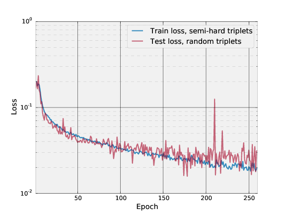

# Model Definitions
Model definitions should be kept in [models/openface](https://github.com/cmusatyalab/openface/blob/master/models/openface),
where we have provided definitions of the [NN2](https://github.com/cmusatyalab/openface/blob/master/models/openface/nn2.def.lua)
and [nn4](https://github.com/cmusatyalab/openface/blob/master/models/openface/nn4.def.lua) as described in the paper,
but with batch normalization and no normalization in the lower layers.
The inception layers are introduced  in
[Going Deeper with Convolutions](http://arxiv.org/abs/1409.4842)
by Christian Szegedy et al.

# Pre-trained Models
Pre-trained models are versioned and should be released with
a corresponding model definition.
We currently only provide a pre-trained model for `nn4.v1`
because we have limited access to large-scale face recognition
datasets.

## nn4.v1
This model has been trained by combining the two largest (of August 2015)
publicly-available face recognition datasets based on names:
[FaceScrub](http://vintage.winklerbros.net/facescrub.html)
and [CASIA-WebFace](http://arxiv.org/abs/1411.7923).
This model was trained for about 300 hours on a Tesla K40 GPU.

The following plot shows the triplet loss on the training
and test set.
Each training epoch is defined to be 1000 minibatches, where
each minibatch processes 100 triplets.
Each testing epoch is defined to be 300 minibatches,
where each minibatch processes 100 triplets.
Semi-hard triplets are used on the training set, and
random triplets are used on the testing set.
Our `nn4.v1` model is from epoch 177.

The LFW section above shows that this model obtains a mean
accuracy of 0.8483 &plusmn; 0.0172 with an AUC of 0.923.

